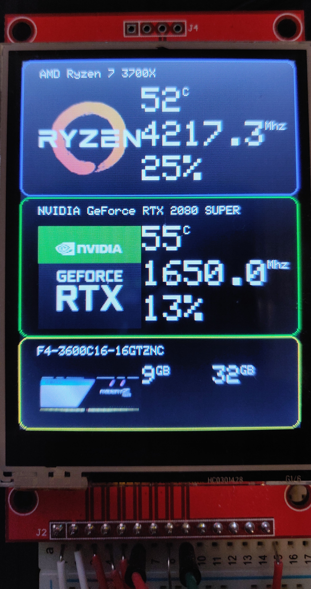
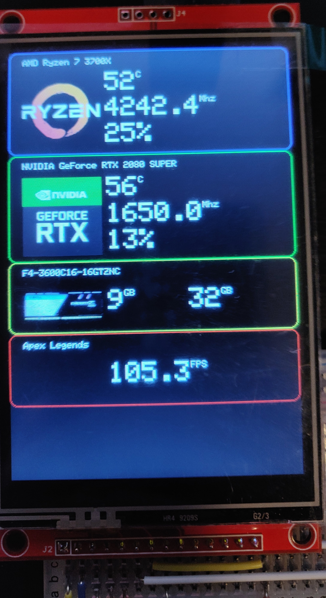
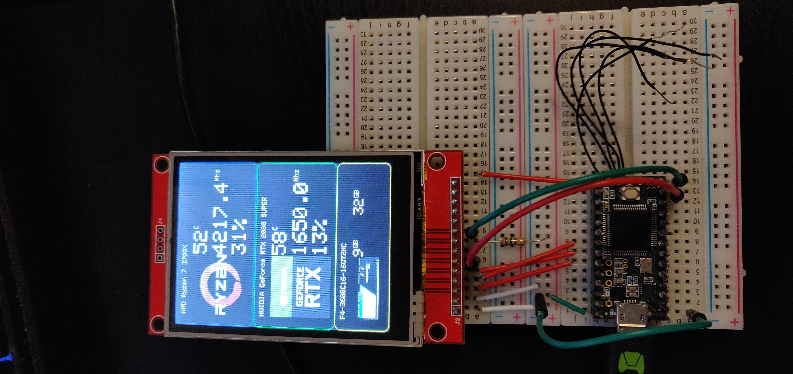
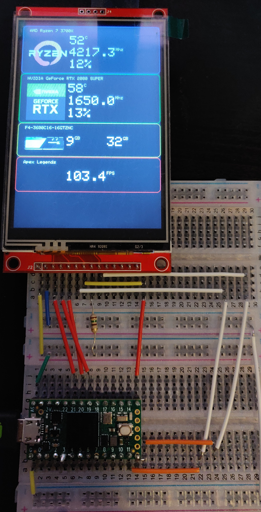
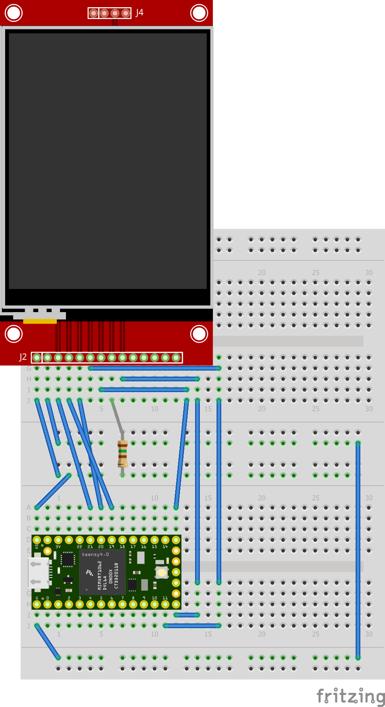

# Dan's open source hardware health monitor
## _A hardware monitor that outputs its metrics for display on an arduino-compatible device_

| |   |
|---    |---
| |   |

The hardware monitor is comprised of two parts:
- Arduino compatible firmware, written in C++
  - This is the code that enables the arduino to display information on the screen
- A windows companion app, written in C#
  - Gathers all the various metrics you might be interested in and sends them to the arduino

## Features
- Support for Teensy 3.2 and 4.0
- Support for ILI9341 TFT modules (320x240 resolution)
- Support for ILI9488 TFT modules (480x320 resolution)
- Gathered metrics and screen layouts are configurable through xml
- The companion app can be extended to offer additional metrics through a simple plugin architecture
- Multiple devices can be plugged in at once (if you so want)

## How to make your own

### What you will need
- A compatible microcontroller. So far I have only tested on the Teensy 3.2 and 4.0. (Support for other microcontrollers is planned)
- A couple of breadboards (You can probably get away with one, but you'll make life easier for yourself with 2)
- A screen. Something powered by either an ILI9341 or an ILI9488 (ILI9486 support will come later)
- Some wires to connect it all together

I have my Teensies setup as shown in the fritzing diagram above, but for reference, here is how you want to connect the teensy to the TFT:

| Teensy    | TFT   |
|---        |---    |
| 5V / Vin  | VCC   |
| GND       | GND   |
| 21        | CS    |
| 19        | Reset |
| 20        | DC    |
| 11        | MOSI  |
| 13        | SCK   |
| 5V / Vin  | LED   |
| 12        | MISO  |

Once you hooked up the device, you'll need to flash the firmware onto it. For now that will mean installing the Arduino IDE (and the Teensy plugin), and compiling and installing the firmware yourself. Hopefully I can make this process more straightforward in future.

## Planned Features
- Device Flashing from the companion app (basically make the companion app capable of updating the device firmware)
- Support for the Seeediuno Xiao microcontroller
- Support for ILI9486
- User layouts and configs
- Allow the user to change the layout from the companion app
- Layout designer

## Special Thanks
This project was inspired by the "Phat Stats" project over on Hackaday: https://hackaday.io/project/19018-phat-stats-pc-performance-tft-display (and it's associated github repository here: https://github.com/koogar/Phat-Stats)
